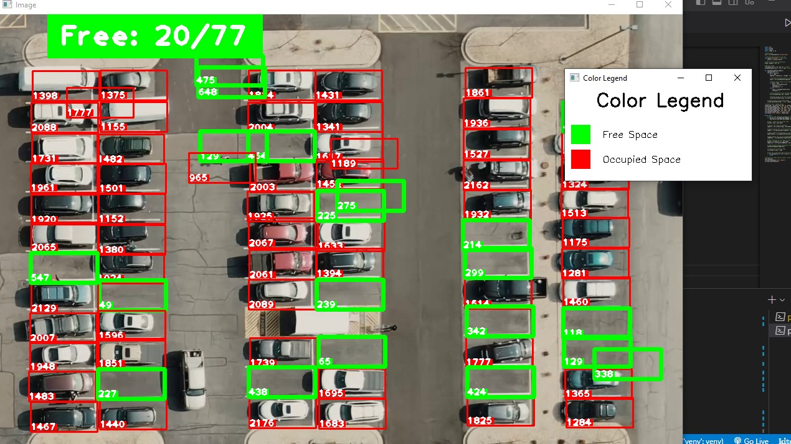

# Car Parking Detection

Car Parking Occupancy detection for detecting free slots from videos from surveillance cameras. The aim is to check whether a slot is occupied or not.

Libraries used are available under `requirements.txt`.
